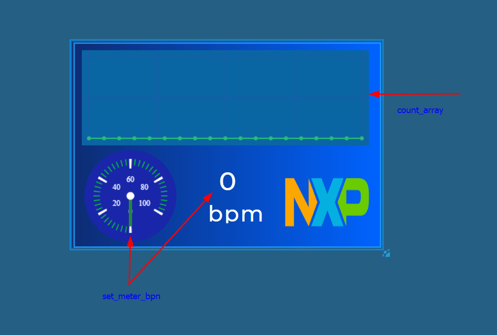

# gui-pbl




## screen_timer_cb - kod działania GUI

1. count_array - jest to funkcja odpowiadająca za liczenie wartości tablicy, która jest używana w wykresie
2. set_meter_bpn - jest to funkcja odpowiadająca za zmianę wartości metera oraz ta sama wartość jako label
3. lv_chart_refresh - funkcja, która odświeża wartości wykresu

```c
void screen_timer_cb(lv_timer_t * t){
    lv_ui * gui = t->user_data;

    count_array(gui->screen_ppg_chart);
    set_meter_bpn(gui->screen_label_bpm_value,gui->screen_meter_bpm, gui->screen_meter_bpm_scale_0_ndline_0);
    lv_chart_refresh(gui->screen_ppg_chart);
}
```
## get_bpm_value - tutaj trzeba przypisać nasz odczytany sygnał do zmiennej **bpn**
```c
int get_bpm_value(){


}
```
## count_array 
**spd_chart** o wielkości **CHART1_POINTS 20** jest zmienną tymczasową do której przypisywane są wartości nowej tablicy
w tej funckji zmienna **ser_array** jest odpowiedzalna za wartości, które są na wykresie i do niej trzeba przypisywać nowe wartości sygnału
```c
#define CHART1_POINTS 20

static int16_t spd_chart[CHART1_POINTS] = {0};

void count_array(lv_obj_t * chart){
    lv_chart_series_t * ser = lv_chart_get_series_next(chart, NULL);
    lv_coord_t * ser_array = lv_chart_get_y_array(chart, ser);


    ser_array[CHART1_POINTS - 1] = spd_chart[CHART1_POINTS - 1];
}
```